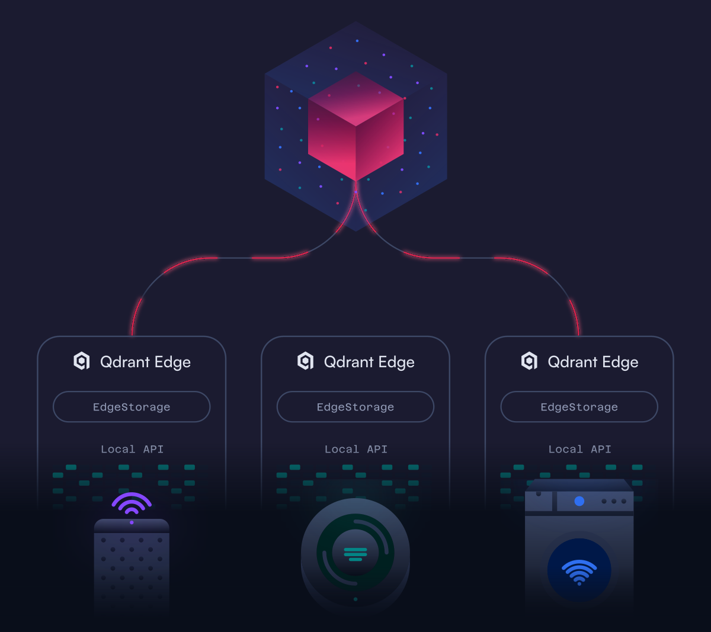

# Building On-Device AI Memory with Qdrant Edge

A [DeepLearning.AI](https://www.deeplearning.ai) short course from
[Qdrant](https://qdrant.tech), taught by Dylan Couzon.

The course builds a private, local memory layer for an AI assistant. The
assistant stores text, photos, and voice notes on the device, then retrieves
the right memory by meaning or metadata. It works after setup without a network
connection.

<p align="center">
  
</p>

## Lessons

| Lesson | Topic | Format |
| --- | --- | --- |
| 1 | Why Devices Need Memory | Video |
| 2 | Store and Recall | Notebook |
| 3 | Finding the Right Memory | Notebook |
| 4 | Your On-Device Assistant | Notebook |
| 5 | Teaching It to See | Notebook and appendix |
| 6 | The Robot | Video |

In the notebooks, you will:

- Store and retrieve memories with Qdrant Edge.
- Search notes and photos with text embeddings.
- Combine semantic search with metadata filters.
- Transcribe voice notes locally.
- Add and query memories of your own.
- Teach the assistant to recognize a chosen subject and test it offline.

## Run the notebooks locally

Use Python 3.12 or newer. The course was built and validated on 3.14.6, and
every package version is pinned so the scores in the saved outputs reproduce.

```bash
python -m venv .venv
source .venv/bin/activate
pip install -r requirements.txt jupyterlab
jupyter lab
```

Open a lesson notebook from `L2/` through `L5/`. One install at the repository
root covers every lesson.

The first run downloads the embedding and transcription models used by the
course. Later runs do not need an API key or an account, and the notebooks can
run offline once the models are present.

The course uses `qdrant-edge-py` 0.7.2. Qdrant Edge is in beta, so its API may
change in future releases.

## Repository layout

```text
L2/ ... L5/              lesson notebooks
requirements.txt         every package the course needs, pinned
helper.py                shared embedding, transcription, chart, and offline helpers
ro_shared_data/          data used by the notebooks
  memories.json          text, voice, and photo memories for Lessons 2–5
  recent_days.json       earlier notes used in Lesson 5
  bank/                  image-search examples for Lesson 3
  audio/                 voice notes for Lesson 4
  images/                scene photos for Lessons 4 and 5
  objects/               multi-view object photos for Lesson 5
```

Each lesson links to the shared helper and data. This mirrors
the DeepLearning.AI course layout, where each lesson is distributed as a
self-contained directory.

## Prerequisites

The course is for Python developers who understand the basics of embeddings and
vector search. It follows Qdrant's
[Retrieval Optimization](https://qdrant.tech/blog/qdrant-deeplearning-ai-course/)
course.

## Image credits

Sample photos are available under CC0 or CC BY-SA licenses. Attribution is in
the `CREDITS.json` files under `ro_shared_data/bank/`,
`ro_shared_data/images/`, and `ro_shared_data/objects/`.
